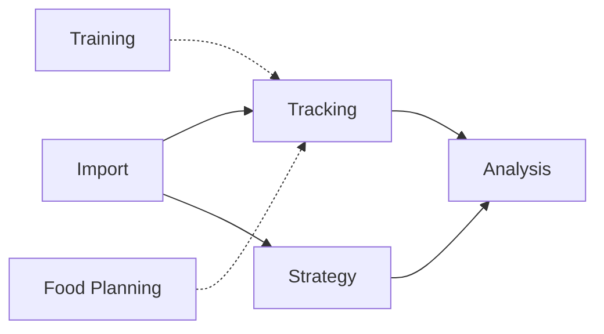

# Tracker implementation plan

## Purpose

Build Tracker incrementally as a local modular monolith that can first preserve
the complete historical spreadsheet data, then reproduce its useful analysis,
and finally add planning capabilities that were impractical in the spreadsheet.

This plan tracks major capabilities and sequencing. Detailed business rules are
decided in the vertical slice that first needs them.

## Progress notation

- `[ ]` Not started
- `[~]` In progress
- `[x]` Complete
- `[!]` Blocked or awaiting a decision

## Agreed context map

### Backend bounded contexts

| Context       | Responsibility                                                                                                                                                |
| ------------- | ------------------------------------------------------------------------------------------------------------------------------------------------------------- |
| Tracking      | User-entered dated records: daily completion, measured weight, weight predictions, nutrition, measurement quality, steps, and performed exercise              |
| Strategy      | Phases, goals, effective-dated policies, day-type strategies and assignments, expected-trajectory definitions, maintenance assumptions, and boundary policies |
| Analysis      | Versioned calculation methods and derived results, including resolved weights, thresholds, rolling evaluations, boundaries, signals, and explanations         |
| Import        | Spreadsheet parsing, translation, validation, dry runs, idempotent execution, and reconciliation reporting                                                    |
| Training      | Future structured exercise definitions, prescriptions, plans, and completed sessions                                                                          |
| Food Planning | Future foods, prices, nutritional composition, meals, and meal plans                                                                                          |

Training and Food Planning are accepted future boundaries but are not created
until their first concrete use cases.

### Frontend contexts

| Context         | Responsibility                                                      |
| --------------- | ------------------------------------------------------------------- |
| Journal         | Daily entry, weight entry, completion, date navigation, and history |
| Strategy        | Phase, goal, rule, schedule, and per-date choice management         |
| Insights        | Progress, rolling analysis, boundaries, signals, and explanations   |
| Training        | Future exercise planning and completion workflows                   |
| Food Planning   | Future food, price, and meal-planning workflows                     |
| Data Management | Import and export workflows when a dedicated UI is useful           |

Frontend contexts follow user workflows and do not have to mirror backend
bounded contexts.

## Boundary decisions

- A calendar date composes information without making every concept one
  aggregate.
- A daily record owns the optional measured weight logged for its date.
- Entering an actual value for a new date starts a daily record in progress.
- Completion is explicit and independent from measurement accuracy.
- A weight prediction is a separate Tracking aggregate and does not create a
  daily record.
- Measured, predicted, expected, interpolated, and carried weights remain
  distinguishable.
- Strategy owns day-type definitions, schedules, rule resolution, and per-date
  assignments.
- Tracking references the strategy classification applied to a daily record
  without owning its rules.
- Analysis owns calculated values and never replaces source observations,
  predictions, or goals.
- Import coordinates owning contexts but does not become the owner of imported
  health or strategy data.
- Cross-context collaboration uses explicit application contracts and
  context-owned representations.
- Contexts do not access another context's repositories or persistence models.
- Direct synchronous collaboration is preferred initially. Events require a
  demonstrated asynchronous or decoupling need.
- No broad shared domain model or generic `Measurement` abstraction is
  introduced initially.
- Context-specific value objects express business meaning and validation.
- A small shared kernel may be proposed later only for proven identical
  primitives, such as unit-safe quantities, and requires an explicit
  architecture decision.
- Internal capability modules organize a context without automatically becoming
  bounded contexts.
- Context tables remain visibly owned and avoid cross-context database foreign
  keys.
- Applied Flyway migrations are never edited.

## Delivery principles

For every meaningful behaviour slice:

1. Confirm the owning context and affected contracts.
2. Add the lowest-level failing behavioural test.
3. Add integration or architecture coverage when crossing those boundaries.
4. Implement the smallest coherent vertical slice.
5. Run `./gradlew format`.
6. Run `./gradlew build`.
7. Update documentation only when an accepted fact or decision changed.
8. Commit the verified slice with a focused message.

Real health data must never enter source control, logs, automated tests, or
committed fixtures. Tests use synthetic data and isolated SQLite databases.

## Milestone 0 — Record the domain boundaries

- [x] Update the canonical domain-modelling decisions with the accepted context
      map.
- [x] Update daily-observation and weight documentation to place measured weight
      inside daily records.
- [x] Record the target frontend context map and its independence from backend
      boundaries.
- [x] Document Tracking's internal capability areas without declaring additional
      bounded contexts.
- [x] Document the shared-kernel decision.
- [x] Remove resolved context-ownership questions from the open-question lists.
- [x] Keep unresolved feature-level rules explicitly open.

### Exit criteria

The documentation consistently describes Tracking, Strategy, Analysis, Import,
and the two deferred contexts without contradicting weight ownership.

## Milestone 1 — Complete Tracking persistence

- [ ] Evolve the existing Tracking context rather than creating a separate
      Weight context.
- [ ] Model daily nutrition observations: calories, protein, and fibre with
      explicit units and absence semantics.
- [ ] Model measurement quality independently from completion.
- [ ] Add optional measured weight to daily records.
- [ ] Model steps so missing and zero remain distinct.
- [ ] Preserve current exercise history as a recorded label and reported energy
      estimate.
- [ ] Mark imported exercise-energy values with spreadsheet provenance and do
      not present them as measured physiological facts.
- [ ] Add a separate dated weight-prediction aggregate.
- [ ] Support creating, reading, editing, completing, and correcting a daily
      record.
- [ ] Add date-range queries needed by history and later analysis.
- [ ] Extend SQLite through new Flyway migrations.
- [ ] Replace the temporary frontend daily-record experience with the Journal
      workflow.
- [ ] Remove dummy frontend contexts when they no longer serve a development
      purpose.

### Decision gates

- Exact numerical ranges and storage precision.
- Completion requirements for measured and intentionally unmeasured days.
- Whether completed records require an explicit reopen action before correction.
- The initial correction-history policy.

### Exit criteria

Every source daily field can be represented without converting missing,
unmeasured, estimated, or zero values into one another.

## Milestone 2 — Establish Strategy history

- [ ] Model stable phase identities and effective periods.
- [ ] Model weight-loss and maintenance modes.
- [ ] Model effective-dated goal histories without unintended gaps or overlaps.
- [ ] Represent expected-weight trajectory endpoints.
- [ ] Represent calorie targets or ranges and protein and fibre rules.
- [ ] Represent the four historical day types.
- [ ] Represent repeating day-type strategies.
- [ ] Represent per-date assignments and overrides independently from
      observations.
- [ ] Represent maintenance assumptions and weight-boundary policies separately
      from calculation methods.
- [ ] Publish a context-owned resolved-strategy result for a date.
- [ ] Add frontend workflows for manually entering and reviewing the relatively
      small phase and goal history.

### Decision gates

- Cycle-position and override semantics.
- Whether unused exceptional-day opportunities can move or accumulate.
- How erroneous historical configuration is corrected.
- Which independently changing policies require separate aggregates.

### Exit criteria

The complete historical strategy can be entered manually, and every historical
date can resolve to an identifiable phase, goal, day assignment, and applicable
policy.

## Milestone 3 — Import and reconcile spreadsheet history

- [ ] Confirm the source format and mapping without exposing personal values.
- [ ] Do not inspect or modify `data/` without explicit authorization.
- [ ] Define a versioned source-to-domain mapping.
- [ ] Keep manual phase and goal entry separate from bulk daily-log import.
- [ ] Import per-date strategy assignments or exceptions that cannot be derived
      reliably.
- [ ] Translate spreadsheet daily rows into Tracking commands.
- [ ] Distinguish measured weight from predicted or calculated spreadsheet
      values before import.
- [ ] Preserve legacy exercise labels and reported energy estimates for later
      Training translation.
- [ ] Implement a complete dry run before mutation.
- [ ] Report invalid rows, duplicates, unresolved strategy dates, and lossy
      translations.
- [ ] Make execution repeatable through import-run identity and row
      fingerprints.
- [ ] Reject conflicting reruns instead of silently overwriting data.
- [ ] Produce a reconciliation report with source, accepted, rejected, and
      skipped counts.
- [ ] Verify the importer using only synthetic fixtures.

### Exit criteria

The 300-plus daily records can be imported without loss of meaning, every
accepted row is traceable to its source, and rerunning the import cannot create
duplicates.

## Milestone 4 — Build the analysis foundation

- [ ] Model calculation-method identity and effective history independently from
      goals.
- [ ] Resolve expected weight from the applicable strategy trajectory.
- [ ] Resolve effective weight from direct measurements and predictions.
- [ ] Implement linear interpolation with explicit endpoint provenance.
- [ ] Implement carry-forward and carry-backward only where the selected method
      permits them.
- [ ] Expose whether a weight is measured, predicted, interpolated, or carried.
- [ ] Retain full intermediate precision and round only at defined boundaries.
- [ ] Generate results on demand initially.
- [ ] Keep inputs and intermediate reasoning available for explanation.

### Decision gates

- Whether predictions may participate in every weight calculation.
- Method effective-date semantics for each calculation family.
- Treatment of corrections when recalculating historical results.
- When, if ever, calculated snapshots need persistence.

### Exit criteria

A weight or expected-weight result for any date can explain its source,
applicable strategy, and calculation method.

## Milestone 5 — Reproduce nutrition analysis

- [ ] Resolve date-specific calorie, protein, and fibre targets.
- [ ] Implement measured-day eligibility and visible exclusions.
- [ ] Implement daily calorie adherence.
- [ ] Implement minimum-oriented protein and fibre evaluation.
- [ ] Implement the accepted rolling calendar windows.
- [ ] Keep calendar-window size distinct from eligible-day coverage.
- [ ] Support intentionally unmeasured days without inventing observations.
- [ ] Explain included dates, exclusions, thresholds, and applicable goals.

### Decision gates

- Final window identities and partial-window behaviour.
- Calorie treatment for intentionally unmeasured exceptional days.
- Protein and fibre threshold equality rules.
- Confidence or presentation rules for incomplete coverage.

### Exit criteria

The application reproduces the accepted spreadsheet nutrition conclusions and
explains differences caused by deliberately changed rules.

## Milestone 6 — Reproduce weight progress and boundaries

- [ ] Calculate rolling observed-side weight results.
- [ ] Compare them with expected trajectories.
- [ ] Implement direction- and severity-specific boundary policies.
- [ ] Version boundary calculation methods independently from policies.
- [ ] Represent simultaneous signals across different windows.
- [ ] Keep signals as evidence for review rather than automatic strategy
      changes.
- [ ] Support weight-loss and maintenance interpretations.
- [ ] Explain references, margins, sources, windows, and methods.

### Decision gates

- Accepted boundary method and parameters.
- Treatment of incomplete coverage and predictions.
- Signal prioritization and acknowledgement.
- Conditions for proposing a goal or maintenance review.

### Exit criteria

Weight progress can be evaluated over the required windows without hiding
provenance or silently reinterpreting historical rules.

## Milestone 7 — Deliver the Insights experience

- [ ] Build a summary dashboard from Analysis queries.
- [ ] Show current strategy and progress.
- [ ] Show recent and longer-window nutrition results.
- [ ] Show weight trajectory and boundary signals.
- [ ] Make important results expandable into explanations.
- [ ] Distinguish missing, unmeasured, provisional, and complete information.
- [ ] Keep presentation composition outside domain ownership.

### Exit criteria

The primary spreadsheet conclusions are accessible without inspecting raw
calculation tables.

## Milestone 8 — Expand beyond the spreadsheet

### Training

- [ ] Define structured exercises and reusable prescriptions.
- [ ] Define planned sessions and plan versions.
- [ ] Record completed and missed sessions explicitly.
- [ ] Translate legacy exercise labels without discarding their original
      provenance.
- [ ] Decide how step and exercise overlap affects energy estimates.

### Food Planning

- [ ] Define foods and nutritional composition.
- [ ] Add price histories and comparison strategies.
- [ ] Define meal possibilities and plans.
- [ ] Make recording planned food as consumed an explicit action.
- [ ] Keep calculated plan totals separate from observed daily intake.

### Data management

- [ ] Add export and backup workflows.
- [ ] Add a Data Management frontend context if repeated user interaction
      justifies it.
- [ ] Preserve local-first privacy and require an explicit decision before any
      external transmission.

## Completion criteria for the initial spreadsheet replacement

The initial replacement is complete when:

- all historical daily and strategy data can be preserved;
- daily information can be entered and corrected without the spreadsheet;
- the accepted nutrition and weight analyses are reproduced;
- results retain source, rule, and method provenance;
- the Journal and Insights workflows cover routine use;
- `./gradlew build` passes;
- real personal data remains local and outside version control.
