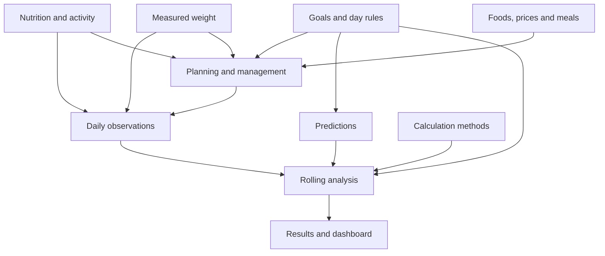

# Tracker domain overview

This directory documents the business knowledge inherited from the original
nutrition and weight tracker and the capabilities intended to extend it.

It describes what the tracked information means and how the different areas
relate. It does not prescribe database tables, API resources or Angular
components. The relationships documented here do not themselves determine
bounded-context boundaries; accepted ownership decisions are summarized below
and recorded canonically in
[domain modelling decisions](../modelling-decisions.md).

It includes both behaviour inherited from the workbooks and planned additions;
it does not indicate which capabilities are currently implemented.

One central analytical question inherited from the tracker is:

> Given what was observed, planned, predicted and expected for a calendar
> period, how does the user’s behaviour and weight compare with the goals and
> rules that applied at that time?

Answering that question requires more than one daily row. It combines
observations, historical goals, predictions, calculation methods and results.

This question does not define the application's full future scope. Pricing
strategies, broader exercise management and other related capabilities
introduce additional questions as concrete needs emerge.

## Working map of documented concepts

This provisional map synthesises knowledge from the workbooks and current
ideas for extending them. Its concepts and relationships are expected to
change as concrete use cases clarify responsibilities and boundaries.

Arrows indicate useful relationships between documented concepts. They do not
prescribe application flows, aggregates, modules or bounded-context
boundaries, and the map is not an exhaustive statement of future scope.

A calendar date can coordinate these concepts without making them one
aggregate or bounded context. They may be managed independently and composed
when a use case requires them together.

## Accepted context ownership

The concept map above remains a description of the problem space. The accepted
application ownership is defined in
[domain modelling decisions](../modelling-decisions.md#bounded-contexts):

- Journal owns user-entered dated information, including daily observations,
  measured weights and separate weight predictions;
- Strategy owns phases, goals, day-type strategies and assignments, and other
  effective-dated policies;
- Analysis owns analytical workflows and meaningful derived results;
- Import translates and coordinates spreadsheet input without owning the
  resulting information;
- Training and Food Planning are deferred contexts whose boundaries are
  accepted but whose detailed models await concrete use cases.

These contexts may contain several aggregates and internal capability modules.
Frontend contexts may instead follow user workflows and do not have to mirror
the backend boundaries.

## Documentation status

These documents preserve knowledge at different levels of maturity. They are
neither a feature backlog nor a statement that every described capability is
implemented.

Production code and tests remain authoritative for implemented behaviour.
Later decisions may supersede the relevance of historical evidence to current
application behaviour, while the historical evidence remains a record of the
tracker and its development.

Planned or exploratory material must not be implemented merely because it is
documented.

## Historical analytical flow

The spreadsheets separated user inputs, rule resolution and calculations, and
published results to make complex formulas understandable. This is historical
evidence, not a required application pipeline; the application may reorganise
or replace it.

Whatever structure is chosen, user-entered facts, plans and predictions must
retain their meaning, rules must be identified for the evaluated date, and
derived results must remain traceable. [Calculation history](calculation-history.md)
preserves the detailed spreadsheet structure and auditability considerations.

## Shared terminology

### Accurately measured intake day

A day for which the relevant intake values were recorded with sufficient
accuracy to be treated as observations rather than uncertainty ranges or
intentionally unmeasured values. Whether such values participate in a
particular calculation is determined by that calculation’s rules.

The precise fields required for an accurately measured intake day depend
on the applicable business rules.

### Actual observation

Information recorded about something that occurred. Actual observations must
remain distinct from plans, predictions and calculated estimates.

### All-in cheat day

A deliberately exceptional high-flexibility day within the repeating strategy.
It is distinct from an accidental overage and from a regular cheat day.

Its precise allowances can vary according to the applicable rule.

### Balance

A calculated difference between observed values and an applicable goal or
threshold over a defined window.

Balances are meaningful only together with:

- their measurement;
- threshold;
- time window;
- applicable goal;
- treatment of missing or unmeasured days.

### Big measured day

A planned higher-intake day whose calories remain accurately measured. It is
distinct from a strict day and from either cheat-day type.

Its applicable calorie range can vary according to the applicable rule.

### Boundary

A permitted or significant deviation from an expected reference weight.

Boundaries may have:

- upward and downward directions;
- first and outer levels;
- different parameters for different analysis windows;
- different rules under different goal or evaluation modes.

### Calculation method

A versioned definition of how a family of derived values is calculated.

Changing a calculation method is different from changing a goal. Both may
require effective dates, but they represent different decisions.

### Calendar date

A civil calendar day without a time or time zone.

Dates organise daily observations, goals, predictions and calculations.
A calendar date is not an instant.

### Completed day

A day whose required actual information has been explicitly marked complete.

Completion is not the same as the day being in the past, and the absence of
a completed record does not necessarily mean that every value is unknown.

### Day type

The category that determines which daily rules apply.

A day type may be scheduled, resolved from a strategy or explicitly overridden.
It must not be inferred solely from the observed calorie intake.

Day type and measurement accuracy are independent. In particular, Regular and
All-in cheat days may be accurately measured or intentionally unmeasured
according to the applicable rule and what actually occurred.

### Derived weight

A weight calculated from other weight information rather than entered directly.

Depending on the applicable method, it may be obtained by interpolation between
suitable endpoints or by carrying an available value when only one suitable
endpoint exists. Its provenance and derivation method must remain distinguishable,
particularly when future predictions participate in the calculation.

### Effective period

The interval during which a goal, rule or calculation method applies.

Periods must be explicit enough to resolve one applicable rule for a date and
detect unintended gaps or overlaps.

### Expected weight

The weight implied by the applicable goal trajectory for a date.

It is not an observation and must not replace a measured or manually predicted
weight.

### Maintenance

A phase or evaluation mode focused on keeping weight within acceptable
longer-term boundaries rather than following a weight-loss trajectory.

Maintenance does not necessarily require perfectly constant daily weight
or calorie intake.

### Measured weight

A weight actually observed by the user.

It must remain distinguishable from a predicted, derived or expected weight.

### Missing value

A value that is absent without a business decision declaring it intentionally
unmeasured.

Missing, unmeasured and zero are different states.

### Phase

A meaningful period in the broader strategy.

A phase may establish default goals and rules, but a goal review may have its
own effective boundaries. Phase and goal history must not be treated as
interchangeable.

### Predicted weight

A manually entered estimate for a future date.

It is an input rather than a calculated expected weight. Predictions may serve
as interpolation endpoints when the applicable method permits it.

### Regular cheat day

A planned higher-flexibility day that is slightly more restricted than an
all-in cheat day.

Depending on the applicable rule and what occurred, its intake may be
accurately measured or intentionally unmeasured.

### Strict day

A normal goal-following day within the strategy.

“Strict” describes the applicable plan, not a guarantee that the observations
met every goal.

### Time window

A defined number of calendar days over which values are aggregated or evaluated.

The tracker uses multiple windows because short-term and long-term deviations
have different meanings.

### Unmeasured day

A day for which sufficiently accurate intake information was intentionally not
recorded.

Its analytical treatment depends on the applicable calculation. It may be
excluded from a calculation or represented through an applicable uncertainty
range, but it must not be represented as zero intake or accidentally contribute
as though the applicable goal had been met exactly.
